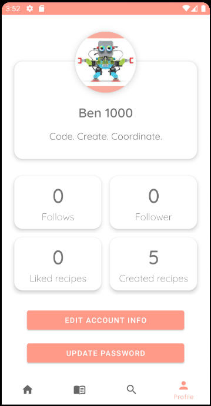
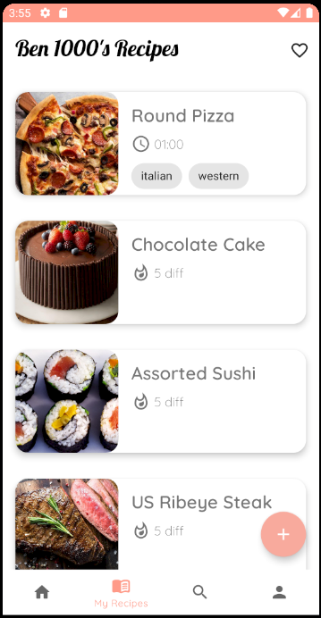
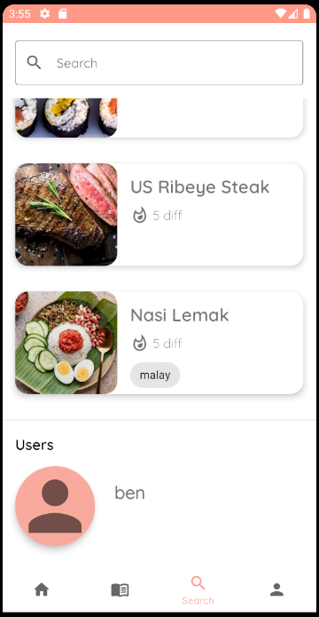

## Team members:
1. Benedict Woo Jun Kai S10203296
2. Melvin Kee Jie En S10205301
3. Wong Jia Hao S10205971

## Description
Create and share recipes. With Sharecipe, this process is made simple. Create your very own recipe with an easy-to-use interface, or even view other people's recipes and broaden your culinary horizons.

Sharecipe provides a platform for cooking enthusiasts ranging from complete beginners to professionals to come together and learn from one another and to pursue their joy for cooking together, where users can leave comments and reviews for recipes created by others. See a recipe that you like? Save it by 'liking' it and add it to your profile! If you like the content of a particular recipe creator, follow them to be the first to see any future uploads!

Sharecipe features:
- Profile page: customise your very own profile with your username, biography and profile picture!
- Recipe creation: use our user-friendly interface to create your very own recipe with images, list of ingredients, steps and much more!
- Learn cooking: view other people's recipes and learn how to cook, even if you're just starting out
- Search recipes: know something you want to cook? Search it in the search bar and see what recipes pop up!
- Categories: not sure what to cook? Choose a recipe based on the many categories, all accessible on the homepage

## Roles and contribution
* **Benedict**: Account management, backend web API
* **Melvin**: Recipe creation and editing
* **Jia Hao**: Profile page and editing

## Features
* Profile:

  This is the profile page where the user will be able to see their infomation and change their profile settings.

  
* Home:

  This is the home page where they will be able to discover recipes that other people posted
  
  
* My recipe:

  This is the page where users will be able to view their own recipes
  
  
* Search:

  This is the search page where users will be able to search for other users and recipes
  
  
  
## User guide
* Register or login upon entering the app for the first time.
* The home page allows you to look at recipes that other people share and recommended recipes
* Press on the bottom right + button to start creating your own recipe
* Add in the information required and then set to public if you want to share it with other people
* View own recipes and liked recipes in the my recipe page with the top right heart button to view liked recipes
* Search for other users and recipes in the search page with the search bar
* Account settings is in the profile page with the buttons at the bottom
